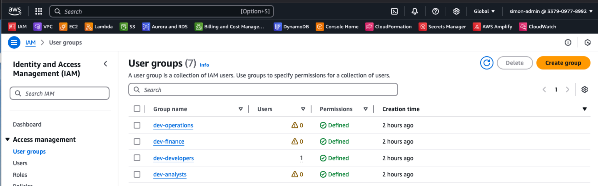

# AWS IAM Configuration

## Overview

This repository contains Terraform code to manage AWS Identity and Access Management (IAM) resources. It implements infrastructure as code (IaC) principles to ensure consistent, version-controlled, and automated management of AWS permissions and security policies.


_Example of IAM user groups created after applying this Terraform configuration_

## Table of Contents

- [Purpose](#purpose)
- [Repository Structure](#repository-structure)
- [Getting Started](#getting-started)
  - [Prerequisites](#prerequisites)
  - [Setup](#setup)
- [Workflow](#workflow)
- [Key Concepts](#key-concepts)
  - [Least Privilege](#least-privilege)
  - [Naming Conventions](#naming-conventions)
  - [Policy Structure](#policy-structure)
- [Business Value](#business-value)
- [Contributing](#contributing)
- [Maintenance](#maintenance)

## Purpose

Managing AWS IAM through Terraform provides several benefits:

- **Consistency**: All IAM configurations follow the same patterns and approval process
- **Auditability**: All changes are tracked in version control
- **Automation**: Reduces manual configuration errors
- **Scalability**: Easily replicate permission models across accounts

## Repository Structure

```bash
aws-iam-config/
├── modules/ # Reusable IAM component definitions
│ ├── roles/ # Common IAM role definitions
│ ├── policies/ # Reusable policy documents
│ └── groups/ # User group configurations
├── environments/ # Environment-specific configurations
│ ├── dev/ # Development environment
│ ├── staging/ # Staging environment
│ └── prod/ # Production environment
├── examples/ # Example implementations
└── tests/ # Automated policy validation tests
```

## Getting Started

### Prerequisites

- [Terraform](https://www.terraform.io/downloads.html) (v1.0.0+)
- AWS CLI configured with appropriate credentials
- Basic understanding of AWS IAM concepts

### Setup

1. Clone this repository:

   ```bash
   git clone https://github.com/your-org/aws-iam-config.git
   cd aws-iam-config
   ```

2. Initialize Terraform:

   ```bash
   terraform init
   ```

3. Plan your changes:

   ```bash
   terraform plan
   ```

4. Apply changes:
   ```bash
   terraform apply
   ```

## Workflow

1. **Create branch**: Create a feature branch for your IAM changes
2. **Make changes**: Modify the Terraform files according to requirements
3. **Test locally**: Run `terraform plan` to preview changes
4. **Create PR**: Submit a Pull Request for review
5. **Review**: Peers review IAM changes for security and compliance
6. **Merge**: After approval, merge changes to main branch
7. **Deploy**: CI/CD pipeline applies changes to appropriate environments

## Key Concepts

### Least Privilege

This repository follows the principle of least privilege:

- Roles and policies grant only the minimum permissions required
- Permissions are regularly reviewed and adjusted
- Temporary credentials are used when possible

### Naming Conventions

All resources follow consistent naming:

```
{environment}-{service}-{purpose}
```

Example: `prod-ec2-readonlyaccess`

### Policy Structure

Policies are organized by:

- Service-specific permissions
- Read vs. write actions
- Resource-level restrictions

## Business Value

- **Risk Reduction**: Enforces security best practices across all AWS accounts
- **Compliance**: Helps maintain regulatory compliance through standardized access controls
- **Operational Efficiency**: Reduces manual IAM administration overhead
- **Onboarding Speed**: New projects can inherit pre-approved IAM configurations
- **Incident Response**: Quick identification and remediation of inappropriate permissions

## Contributing

1. Review the [contribution guidelines](CONTRIBUTING.md)
2. Ensure your changes meet security best practices
3. Include tests for any new IAM configurations
4. Update documentation to reflect your changes

## Maintenance

The IAM configurations should be regularly reviewed and updated:

- Remove unused permissions and roles
- Update policies based on AWS service changes
- Conduct periodic access reviews

---

For questions or support, contact the Cloud Infrastructure team.
