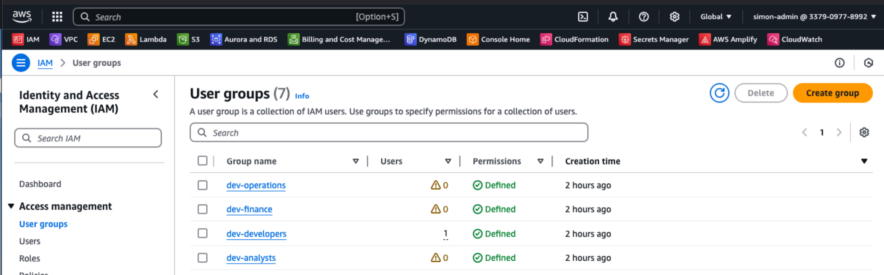

# AWS IAM Groups with Terraform

Terraform modules that create four role-based IAM groups (developers, analysts, finance, operations), attach scoped policies to each, require MFA for every group member, and set an account password policy.

**Status:** Live. Validated 2026-09-26: destroyed, rebuilt from an empty state, and checked with the IAM policy simulator (24/24 checks passed). `terraform fmt` and `terraform validate` run in GitHub Actions on every push and pull request.
**Scope:** Personal hands-on AWS project. First built 2025-03-04, reworked 2026-09.


_The four groups in the IAM console after the first apply (2025-03-04)._

## How it fits together

```
main.tf
├── module "policies"  (policies/)  creates 13 scoped policies, outputs their ARNs per team
├── module "groups"    (groups/)    creates 4 groups, attaches the ARNs passed in from "policies"
├── module "security"  (security/)  creates RequireMFA, attaches it to every group; account password policy
└── aws_iam_user "dev-example"      demo user (no credentials) in the developers group
```

## What it creates (38 resources)

| Resource | Count |
|---|---|
| IAM groups (`dev-developers`, `dev-analysts`, `dev-finance`, `dev-operations`) | 4 |
| Scoped policies | 13 |
| `dev-RequireMFA` policy | 1 |
| Group policy attachments (13 scoped + 4 RequireMFA) | 17 |
| Account password policy | 1 |
| `dev-example` user + group membership | 2 |

Group and policy names are prefixed with the `environment` variable (default `dev`). The demo user is always `dev-example`.

## Group permissions

| Group | Allowed | Scope |
|---|---|---|
| Developers | EC2 `Describe*`, `RunInstances`, `StartInstances`, `StopInstances`; S3 get/put/list; CloudWatch and Logs read | S3 limited to `app-files-bucket*` |
| Analysts | S3 get/list; 6 named Athena query actions; CloudWatch read | S3 limited to `analytics-data-*` and `data-warehouse-*` |
| Finance | Cost Explorer; view billing, usage, and budgets; S3 get/list | S3 limited to `finance-reports-*` |
| Operations | Full access to EC2, CloudWatch/Logs/EventBridge, Elastic Load Balancing, and Systems Manager | Service-scoped (full access within each service) |

Every group also gets `RequireMFA`: without an MFA session, members are denied everything except MFA setup, `iam:GetUser`, and `sts:GetSessionToken`.

This is role-based access with enforced MFA, not least privilege: the developer, analyst, and finance policies name specific actions, but the operations group has service-wide access (`ec2:*`, `cloudwatch:*`, `logs:*`, `events:*`, `elasticloadbalancing:*`, `ssm:*`), and most policies apply to `Resource = "*"`.

**Password policy (account-wide):** minimum 12 characters with upper, lower, number, and symbol; 90-day expiry; last 5 passwords can't be reused; users can change their own password.

## Design decisions

- **Modules connected through outputs and inputs.** `policies` outputs a map of ARNs per team; `groups` attaches whatever it receives. Adding a policy to a team means adding one map entry.
- **Static map keys for `for_each`.** The ARNs aren't known until apply, but the keys (`ec2`, `s3`, …) are, so Terraform can plan the attachments on a fresh account.
- **MFA enforced with an explicit Deny.** An explicit Deny overrides any Allow, so a group member without MFA can't use the group's permissions.
- **Admin users stay out of these groups.** The same explicit Deny would block an administrator who isn't using an MFA session, including the user running Terraform.
- **Password policy is optional.** The `security` module's `enable_password_policy` input defaults to `true`; set it to `false` in `main.tf` to leave the account policy alone. It's optional because it applies to every IAM user in the account, not only these groups.

## How to use

**Prerequisites**
- Terraform 1.0+ (tested with 1.5.7, which CI uses) and the AWS CLI, with credentials that can manage IAM.
- The user running Terraform must **not** be a member of these groups (see Design decisions).
- No other users added to these groups by hand. Terraform only removes memberships it manages, and AWS won't delete a group that still has members.

**Steps and expected results**

| Step | Command | Expected result |
|---|---|---|
| 1. Initialize | `terraform init` | Provider installed |
| 2. Preview | `terraform plan` | `Plan: 38 to add, 0 to change, 0 to destroy` on an empty account |
| 3. Deploy | `terraform apply` | `38 added` (a few seconds) |
| 4. Check permissions | `./scripts/validate.sh` | `24 passed, 0 failed` (about 1 minute) |
| 5. Check for drift | `terraform plan -detailed-exitcode` | Exit code `0` (no changes) |
| 6. Tear down | `terraform destroy` | `38 destroyed`; the account password policy is removed |

`scripts/validate.sh` is read-only. It runs the IAM policy simulator against each group and checks three things: in-scope actions are allowed, out-of-scope actions are denied, and every action except MFA setup is denied without MFA.

**What to expect after deploying**
- The password policy applies to **every IAM user in the account**. Users whose password is older than 90 days must set a new one at their next console sign-in.
- Members of these groups can only use their permissions after signing in with MFA.

**Customize**
- **Add a user to a group:** copy the `dev-example` block in `main.tf` (an `aws_iam_user` plus an `aws_iam_user_group_membership`) and point `groups` at the group output you want, for example `module.groups.analysts_group_name`. Create the user's console password or access keys outside Terraform so no credentials land in state.
- **Change the name prefix:** `terraform apply -var environment=staging`. Because the password policy is account-wide, keep one environment per account (see Known limitations).
- **Add a policy to a team:** add an `aws_iam_policy` in `policies/<team>_policies.tf`, then add one entry to that team's map in `policies/outputs.tf`. The `groups` module attaches it on the next apply.
- **Skip the account password policy:** pass `enable_password_policy = false` to `module "security"` in `main.tf`.

**Validation record (2026-09-26)**
- `terraform destroy`: 51 resources removed (the earlier wildcard-policy version) in 17 s. The account was checked afterwards: no groups, policies, demo user, or password policy remained.
- `terraform apply` from an empty state: 38 resources in 4 s.
- Drift check: no changes.
- `scripts/validate.sh`: 24/24 passed.

## Known limitations

- **Operations has full access within its four services** (for example, `ec2:*`). It's scoped by service, not by action.
- **Athena needs more than the analyst policy grants.** Running queries also needs Glue Data Catalog read access and an S3 query-results location.
- **The S3 bucket patterns are examples.** No buckets with those names exist in this project.
- **Local state.** There's no remote backend or state locking, so this isn't set up for a team.
- **One environment per account.** The password policy is an account-wide setting, so two environments in the same account would conflict over it.

## Next steps

- Move state to an S3 backend with locking.
- Add Glue and query-results permissions for analysts, and narrow operations to named actions.
- Run `terraform plan` in CI using GitHub OIDC. CI currently runs only `fmt` and `validate`, with no AWS credentials.
- Add a policy linter such as `tflint` or `checkov`.

## Repository structure

```
├── main.tf, variables.tf, outputs.tf, providers.tf
├── policies/      scoped IAM policies per team, outputs.tf exposes ARNs
├── groups/        IAM groups and their policy attachments
├── security/      RequireMFA policy and account password policy
├── scripts/       validate.sh (policy simulator checks)
├── docs/          screenshot
└── .github/workflows/terraform.yml   fmt + validate on push and PR
```

---

[simoncheam.dev](https://simoncheam.dev) · [LinkedIn](https://www.linkedin.com/in/simoncheam/)
